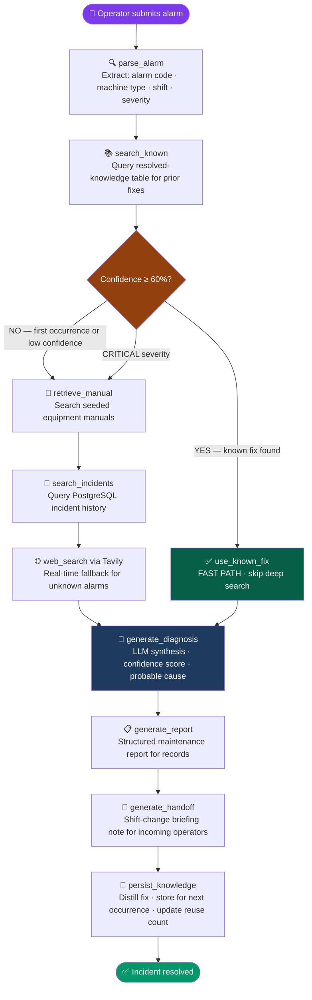

<div align="center">

<br/>

`⚡ 8 seconds` &nbsp;**·**&nbsp; `not 45 minutes` &nbsp;**·**&nbsp; `not a phone call at 2 AM`

<br/>


<br/><br/>

[](https://react.dev)&nbsp;
[](https://www.typescriptlang.org)&nbsp;
[](https://spring.io/projects/spring-boot)&nbsp;
[](https://python.org)&nbsp;
[](https://langchain-ai.github.io/langgraph/)&nbsp;
[](https://postgresql.org)&nbsp;
[](https://docs.docker.com/compose/)

<br/>

[](https://github.com/panakantinandu/factoryflow-AI/stargazers)&nbsp;&nbsp;
[](https://github.com/panakantinandu/factoryflow-AI/network/members)&nbsp;&nbsp;
[](LICENSE)&nbsp;&nbsp;
[](https://factoryflow-ai.vercel.app)

<br/>

</div>

---

<div align="center">

### _"Machine alarms resolved in 8 seconds. Not 45 minutes. Not a phone call at 2 AM."_

**FactoryFlow AI** is a polyglot manufacturing copilot — Spring Boot + LangGraph + React — that diagnoses machine alarms through autonomous multi-step reasoning, retrieves institutional knowledge, generates maintenance reports, and compounds in intelligence with every resolved incident.

[**→ Live Demo**](https://factoryflow-ai.vercel.app) &nbsp;·&nbsp; [**→ Watch It Run**](#demo-walkthrough) &nbsp;·&nbsp; [**→ Get Started in 5 min**](#getting-started)

</div>

---

## 📋 Table of Contents

- [The Problem](#-the-problem)
- [How It Works](#-how-it-works)
- [Agent Reasoning Graph](#-agent-reasoning-graph)
- [Knowledge Compounding](#-knowledge-compounding)
- [System Architecture](#-system-architecture)
- [Tech Stack](#-tech-stack)
- [Pages & Features](#-pages--features)
- [What Makes This Different](#-what-makes-this-different)
- [Getting Started](#-getting-started)
- [Project Structure](#-project-structure)
- [Demo Walkthrough](#-demo-walkthrough)
- [Roadmap](#-roadmap)

---

## 🔴 The Problem

Manufacturing operators lose **20–60 minutes per alarm** doing this manually:

```
ALARM FIRES          SEARCH PDF MANUAL      FIND NOTHING        CALL SENIOR TECH
     │                       │                    │                     │
     ▼                       ▼                    ▼                     ▼
 ⚠  E217          📄 flipping pages         😤 not there         📞 at 2 AM
     │
     │    ← Next shift. Same alarm. Zero institutional memory.
     ▼
 Starts from zero. Every. Single. Time.
```

**Four compounding failures killing production floors:**

| Failure | Reality |
|---|---|
| 🔍 **No Retrieval** | Manuals exist as PDFs no one can search under pressure |
| 🧠 **No Memory** | Prior resolutions live in one technician's head |
| 📝 **No Documentation** | Maintenance reports written manually, hours later, wrong |
| 🔄 **No Handoff** | Tribal knowledge evaporates when experienced techs leave |

---

## ⚡ How It Works

```
  BEFORE                              AFTER
  ─────────────────────────────────   ─────────────────────────────────────────
  Alarm fires                         Alarm fires
  → Operator searches PDF (15 min)    → Operator types alarm in plain language
  → Calls senior tech (10 min)        → Agent parses, searches, reasons (8 sec)
  → Waits for callback (20 min)       → Diagnosis + report + handoff generated
  → Writes report by hand (15 min)    → Fix stored for next occurrence
  → Shift ends. Knowledge gone.       → Every recurrence gets faster.

  Total: 45-60 minutes                Total: 8-45 seconds
  Knowledge retained: 0%             Knowledge retained: 100%
```

---

## 🧠 Agent Reasoning Graph

> The core engine is a **LangGraph state machine** with real conditional branching — not a fixed RAG pipeline. Every path decision is visible to the operator in real time.



**Branching logic:**
- `CRITICAL` severity → **always** forces deep search regardless of knowledge match
- Confidence < 60% → manual + incident + web search all run before diagnosing
- Known fix found → fast path skips all deep search, resolves in ~8 seconds

---

## 📈 Knowledge Compounding

> The more incidents FactoryFlow resolves, the faster every future resolution becomes. This is the core value proposition — not just AI diagnosis, but institutional memory that compounds.

```
ALARM E217 ─── FIRST OCCURRENCE ──────────────────────────────────────────────
  parse_alarm
    → search_known     ✗ MISS (no prior history)
    → retrieve_manual  ✓ section 4.3: conveyor sensor fault
    → search_incidents ✗ 0 prior incidents
    → web_search       ✓ photoelectric sensor drift confirmed
    → generate_diagnosis → generate_report → generate_handoff
    → persist_knowledge  [fix stored ✓]

  ⏱  ~45 seconds    📊 Confidence: 71%    🔎 Source: deep_search

──────────────────────────────────────────────────────────────────────────────
ALARM E217 ─── SECOND OCCURRENCE (different shift, next day) ─────────────────
  parse_alarm
    → search_known     ✓ HIT — confidence 94% — fast path engaged
    → use_known_fix    ✓ retrieved last night's validated fix
    → generate_diagnosis → generate_report → generate_handoff
    → persist_knowledge  [reuse count: 1 ✓]

  ⏱  ~8 seconds     📊 Confidence: 94%    🔎 Source: known_resolution

──────────────────────────────────────────────────────────────────────────────
ALARM E217 ─── FIFTH OCCURRENCE (weeks later, any shift) ────────────────────
  parse_alarm → search_known ✓✓✓ → use_known_fix → ...

  ⏱  ~6 seconds     📊 Confidence: 97%    🔎 Source: known_resolution × 4

──────────────────────────────────────────────────────────────────────────────
```

> **Cross-fleet compounding:** A fix found for Machine A on Line 1 automatically matches the same alarm code on Machine B on Line 3. One resolution benefits the entire production floor.

---

## 🏗️ System Architecture

```
╔═══════════════════════════════════════════════════════════════════╗
║                          BROWSER                                  ║
║  ┌─────────────────────────────────────────────────────────────┐  ║
║  │              React 18 + TypeScript + Vite  (:5173)          │  ║
║  │   Diagnose · Dashboard · History · Knowledge Base           │  ║
║  │   Live SSE reasoning stream · Animated file reader          │  ║
║  └────────────────────────┬────────────────────────────────────┘  ║
╚═══════════════════════════╪═══════════════════════════════════════╝
                            │ REST / SSE
            ┌───────────────▼──────────────┐
            │    Spring Boot 3  (:8080)     │  ← Java 17
            │                               │
            │  ✦ REST API surface           │
            │  ✦ PostgreSQL persistence     │
            │  ✦ Request orchestration      │
            │  ✦ Zero LLM calls (by design) │
            └───────────────┬──────────────┘
                            │ HTTP (sync + stream)
            ┌───────────────▼──────────────┐
            │   LangGraph Agent  (:8000)    │  ← Python 3.11
            │                               │
            │  ✦ State machine graph        │
            │  ✦ Tool node implementations  │
            │  ✦ All LLM inference calls    │
            │  ✦ SSE streaming to frontend  │
            └──────────┬────────┬──────────┘
                       │        │
         ┌─────────────▼──┐  ┌──▼──────────────────┐
         │   PostgreSQL    │  │    External APIs      │
         │                 │  │                       │
         │  · incidents    │  │  Featherless AI       │
         │  · reports      │  │  (LLM inference)      │
         │  · handoffs     │  │                       │
         │  · knowledge    │  │  Tavily Search        │
         └─────────────────┘  │  (web fallback)       │
                              └───────────────────────┘
```

> **Why polyglot?** Java owns transactional integrity and the API surface. Python owns AI orchestration. LangGraph has no mature Java equivalent — splitting responsibilities by language strength is a stronger engineering decision than forcing one language to do everything.

---

## 🛠️ Tech Stack

| Layer | Technology | Why |
|---|---|---|
| **Frontend** | React 18 + TypeScript + Vite | Type-safe component model, fast HMR |
| **Styling** | Tailwind CSS + JetBrains Mono | Dark factory-terminal aesthetic |
| **Charts** | Recharts | Dashboard KPI visualisations |
| **API Layer** | Spring Boot 3 (Java 17) | Production-grade REST, JPA, connection pooling |
| **AI Agent** | LangGraph 1.2.5 (Python 3.11) | Real conditional branching state machine |
| **LLM** | Featherless AI (`watt-ai/watt-tool-70B`) | Tool-calling inference, no rate limits |
| **Web Search** | Tavily | Real-time fallback for unknown alarms |
| **Database** | PostgreSQL 16 | Incidents, reports, handoffs, knowledge base |
| **Infra** | Docker Compose | One-command local dev: `docker compose up` |

---

## 📱 Pages & Features

### Diagnose
Submit any machine alarm in plain language. Watch the agent reason through it live via Server-Sent Events — every node, branch decision, and tool call streamed to the UI as it happens. Receive diagnosis, maintenance report, and shift handoff note in one flow.

### Dashboard
KPI cards: total incidents resolved, mean time to resolution, fast-path rate, estimated time saved. Alarm frequency chart by code. Machine health board across the floor.

### History
Paginated incident log filterable by alarm code, machine, shift, and status. Expandable rows show full diagnosis, report, and handoff for any past incident.

### Knowledge Base
Every distilled fix the system has learned — alarm code, reuse count, last used timestamp, confidence score. Expandable to show full cause + fix. Deletable when superseded.

### Animated File Reader
Operators attach `.txt`, `.log`, `.csv`, `.json`, `.yaml` alarm logs or shift reports directly in the UI. A terminal-style byte-scanning animation plays while the file is parsed, then its contents are injected into the input field.

---

## 🎯 What Makes This Different

Most AI projects at any hackathon are a RAG-based PDF Q&A wrapper. Three deliberate choices separate FactoryFlow:

### 1 — Visible Branching Reasoning

```
Typical "AI agent":    Input ──────────────────────► LLM ──► Output
                       (same path every time, zero decisions)

FactoryFlow AI:        Input ──► parse ──► search ──► confidence check
                                                            │
                                                  ┌─────────┴─────────┐
                                                  │                   │
                                             FAST PATH           DEEP SEARCH
                                            (known fix)     (manual + web + db)
                                                  │                   │
                                                  └─────────┬─────────┘
                                                            │
                                               diagnose ──► report ──► handoff
```

Every branch decision is shown in the UI **live**, as it happens. Operators see exactly why the agent made each choice.

### 2 — Compounding Knowledge, Visible on Stage

```
Demo run 1:  E217 → 45 seconds → deep search → fix found → stored
Demo run 2:  E217 →  8 seconds → FAST PATH   → same fix  → reuse count: 1

The improvement is visible. Not claimed in a slide. It happens live.
```

### 3 — Intentional Tool Design

| Tool | What it actually does |
|---|---|
| `retrieve_manual` | Real seeded equipment manual data, section-level retrieval |
| `search_incidents` | Live PostgreSQL query against actual incident history |
| `generate_report` | Structured output via careful prompt engineering |
| `generate_handoff` | Specific shift-handoff format operators actually use |
| `web_search` | Real Tavily API call — live web results for unknown alarms |

Five real tools that work end-to-end. Not five stubs returning placeholder strings.

---

## 🚀 Getting Started

### Prerequisites

```bash
java -version      # 17+  — Spring Boot API
python3 --version  # 3.11+ — LangGraph agent
node -v            # 18+  — React frontend
docker -v          # Docker Compose for PostgreSQL
```

You'll also need:
- [Featherless AI API key](https://featherless.ai) (free tier available)
- [Tavily API key](https://tavily.com) (free tier: 1,000 searches/month)

### 1 — Clone & Configure

```bash
git clone https://github.com/panakantinandu/factoryflow-AI.git
cd factoryflow-AI

# Copy all env templates
cp agent-service/.env.example agent-service/.env
cp backend-api/.env.example   backend-api/.env
cp frontend/.env.example      frontend/.env
```

Fill in your keys:

```env
# agent-service/.env
FEATHERLESS_API_KEY=your_featherless_key_here
TAVILY_API_KEY=your_tavily_key_here

# backend-api/.env
DATABASE_URL=jdbc:postgresql://localhost:5432/factoryflow
DB_USERNAME=postgres
DB_PASSWORD=postgres

# frontend/.env
VITE_AGENT_URL=http://localhost:8000
VITE_API_URL=http://localhost:8080/api
```

### 2a — Run with Docker (recommended)

```bash
docker compose up --build
```

| Service | URL |
|---|---|
| React frontend | http://localhost:5173 |
| Spring Boot API | http://localhost:8080 |
| LangGraph agent | http://localhost:8000 |

### 2b — Run manually (three terminals)

```bash
# Terminal 1 — PostgreSQL
docker compose up -d db

# Terminal 2 — LangGraph agent
cd agent-service
python3 -m venv venv && source venv/bin/activate  # Windows: venv\Scripts\activate
pip install -r requirements.txt
uvicorn app.main:app --reload --port 8000

# Terminal 3 — Spring Boot API
cd backend-api
mvn spring-boot:run

# Terminal 4 — React frontend
cd frontend
npm install && npm run dev
```

### 3 — Try the demo flow

1. Open http://localhost:5173
2. Select **Night** shift
3. Type: `Packaging line alarm E217 — Line B, keeps stopping mid-cycle`
4. Click **Diagnose** — watch the agent reason live
5. Submit the same alarm again — observe the fast path engage

---

## 📁 Project Structure

```
factoryflow-AI/
│
├── frontend/                        # React · TypeScript · Vite
│   └── src/
│       ├── components/
│       │   ├── ChatInput.tsx        # Alarm input · shift selector · file reader
│       │   ├── FileReadZone.tsx     # Animated byte-scan file reader
│       │   ├── ReasoningStream.tsx  # Live SSE agent step trace
│       │   ├── DiagnosisCard.tsx    # Diagnosis · report · handoff output
│       │   ├── StatCard.tsx         # Dashboard KPI card
│       │   └── Sidebar.tsx          # Navigation
│       ├── pages/
│       │   ├── DiagnosePage.tsx     # Main diagnose interface
│       │   ├── DashboardPage.tsx    # KPIs · alarm chart · machine health
│       │   ├── HistoryPage.tsx      # Paginated incident log
│       │   └── KnowledgePage.tsx    # Knowledge base browser
│       └── lib/
│           └── api.ts               # REST calls + SSE stream client
│
├── backend-api/                     # Spring Boot · Java 17 · PostgreSQL
│   └── src/main/java/
│       ├── controller/              # REST endpoint handlers
│       ├── service/                 # Orchestration · agent proxying
│       ├── repository/              # JPA repositories
│       └── entity/                  # Incident · Report · Handoff · Knowledge
│
├── agent-service/                   # Python 3.11 · LangGraph · FastAPI
│   └── app/
│       ├── graph/                   # State machine: nodes + conditional edges
│       ├── tools/                   # Manual retrieval · incident search · web
│       ├── prompts/                 # LLM prompt templates per node
│       └── main.py                  # FastAPI app · SSE stream endpoint
│
├── data/                            # Seeded equipment manuals + sample incidents
│
├── docs/
│   ├── agent-graph.md               # LangGraph node/edge design reference
│   ├── schema.md                    # PostgreSQL schema (7 tables)
│   └── demo-script.md               # Live demo walkthrough
│
└── docker-compose.yml               # One-command dev environment
```

---

## 🎬 Demo Walkthrough

### Run 1 — First occurrence (deep search path)

```
Input: "Packaging line alarm E217 — Line B, keeps stopping mid-cycle"
Shift: Night

◈  parse_alarm        ✓  E217 · Packaging Line B · Night · MEDIUM
⌗  search_known       ✗  no prior resolutions found
⊞  retrieve_manual    ✓  section 4.3: conveyor photoelectric sensor
⊟  search_incidents   ✗  0 incidents for E217
⊕  web_search         ✓  sensor drift on Allen-Bradley photoelectric units
◆  generate_diagnosis ✓  probable cause: photoelectric sensor contamination
▣  generate_report    ✓  structured maintenance report written
▤  generate_handoff   ✓  morning shift briefing: clean sensor housing
▲  persist_knowledge  ✓  fix stored · confidence 71% · source: deep_search

─────────────────────────────────────────────────────────────────
Time: ~45 seconds    Confidence: 71%    Source: deep_search
─────────────────────────────────────────────────────────────────
```

### Run 2 — Second occurrence (fast path)

```
Input: "E217 alarm again on Line B"
Shift: Day (different operator)

◈  parse_alarm        ✓  E217 · Packaging · Day
⌗  search_known       ✓  MATCH — last night's fix · confidence 94%
✓  use_known_fix      ✓  fast path engaged · deep search skipped
◆  generate_diagnosis ✓  confirmed + shift-contextualised
▣  generate_report    ✓  written
▤  generate_handoff   ✓  written
▲  persist_knowledge  ✓  reuse count: 1

─────────────────────────────────────────────────────────────────
Time: ~8 seconds     Confidence: 94%    Source: known_resolution
─────────────────────────────────────────────────────────────────
```

> Dashboard → Knowledge Base panel shows E217 with reuse count incrementing after each run.

---

## 🗺️ Roadmap

- [ ] **Voice input** — hands-free alarm submission on the production floor
- [ ] **Predictive alerts** — flag machines before alarms fire based on pattern history
- [ ] **Multi-language support** — Spanish, German, Mandarin for global manufacturing sites
- [ ] **Mobile-optimised view** — tablet-native layout for use at machine side
- [ ] **Knowledge export** — PDF export of the full knowledge base for compliance documentation
- [ ] **Fleet analytics** — cross-line alarm frequency heatmaps and MTTR trends

---

## 🤝 Contributing

Contributions, issues, and feature requests are welcome.

1. Fork the repo
2. Create your feature branch: `git checkout -b feature/your-feature`
3. Commit your changes: `git commit -m 'Add your feature'`
4. Push to the branch: `git push origin feature/your-feature`
5. Open a Pull Request

---

## 📜 License

MIT © [Nandu Panakanti](https://github.com/panakantinandu)

---

<div align="center">

**Built for manufacturing teams who don't have time to search PDFs at 2 AM.**

<br/>

[](https://nandu-portfolio-three.vercel.app)
[](https://linkedin.com/in/nandu-panakanti-41839731a)


</div>
